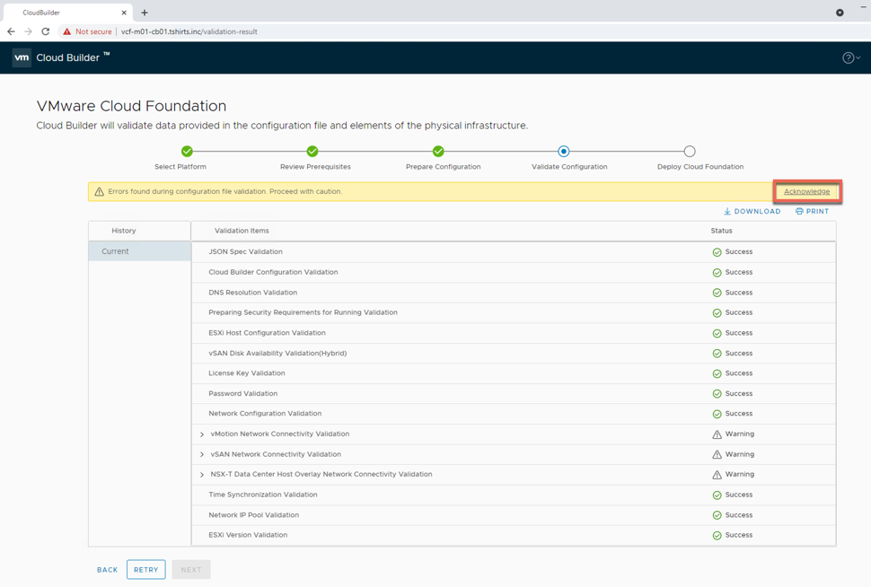

# Automated VMware Cloud Foundation Lab Deployment

## Table of Contents

* [Description](#description)
* [Changelog](#changelog)
* [Requirements](#requirements)
* [Configuration](#configuration)
* [Logging](#logging)
* [Sample Execution](#sample-execution)
    * [Lab Deployment Script](#lab-deployment-script)
    * [Deploy VMware Cloud Foundation](#deploy-vmware-cloud-foundation)

## Description

Similar to previous "Automated Lab Deployment Scripts" (such as [here](https://www.williamlam.com/2016/11/vghetto-automated-vsphere-lab-deployment-for-vsphere-6-0u2-vsphere-6-5.html), [here](https://www.williamlam.com/2017/10/vghetto-automated-nsx-t-2-0-lab-deployment.html), [here](https://www.williamlam.com/2018/06/vghetto-automated-pivotal-container-service-pks-lab-deployment.html), [here](https://www.williamlam.com/2020/04/automated-vsphere-7-and-vsphere-with-kubernetes-lab-deployment-script.html), [here](https://www.williamlam.com/2020/10/automated-vsphere-with-tanzu-lab-deployment-script.html) and [here](https://williamlam.com/2021/04/automated-lab-deployment-script-for-vsphere-with-tanzu-using-nsx-advanced-load-balancer-nsx-alb.html)), this script makes it very easy for anyone to deploy a "basic" VMware Cloud Foundation (VCF) in a Nested Lab environment for learning and educational purposes. All required VMware components (ESXi and Cloud Builder VMs) are automatically deployed and configured to allow for VCF to be deployed and configured using VMware Cloud Builder. For more information, you can refer to the official [VMware Cloud Foundation documentation](https://docs.vmware.com/en/VMware-Cloud-Foundation/4.0/com.vmware.vcf.ovdeploy.doc_40/GUID-F2DCF1B2-4EF6-444E-80BA-8F529A6D0725.html).

Below is a diagram of what is deployed as part of the solution and you simply need to have an existing vSphere environment running that is managed by vCenter Server and with enough resources (CPU, Memory and Storage) to deploy this "Nested" lab. For VCF enablement (post-deployment operation), please have a look at the [Sample Execution](#sample-execution) section below.

You are now ready to get your VCF on! 😁


## Changelog
* **02/09/2023**
  * Update ESXi Memory to fix "Configure NSX-T Data Center Transport Node" and "Reconfigure vSphere High Availability" failing tasks by increasing ESXi memory to 46GB [explained here](http://strivevirtually.net) 

* **01/21/2023**
  * Added support for [VCF 4.5](https://imthiyaz.cloud/automated-vcf-deployment-script-with-nested-esxi)
  * Fixed vSAN bootdisk size
  * Follow [KB 89990](https://kb.vmware.com/s/article/89990) if you get "Gateway IP Address for Management is not contactable"
  * If Failed VSAN Diskgroup follow [FakeSCSIReservations](https://williamlam.com/2013/11/how-to-run-nested-esxi-on-top-of-vsan.html)

* **05/25/2021**
  * Initial Release

## Requirements
* vCenter Server running at least vSphere 6.7 or later
    * If your physical storage is vSAN, please ensure you've applied the following setting as mentioned [here](https://www.williamlam.com/2013/11/how-to-run-nested-esxi-on-top-of-vsan.html)
* ESXi Networking
  * Enable either [MAC Learning](https://williamlam.com/2018/04/native-mac-learning-in-vsphere-6-7-removes-the-need-for-promiscuous-mode-for-nested-esxi.html) or [Promiscuous Mode](https://kb.vmware.com/kb/1004099) on your physical ESXi host networking to ensure proper network connectivity for Nested ESXi workloads
* Resource Requirements
    * Compute
        * Ability to provision VMs with up to 8 vCPU
        * Ability to provision up to 192 GB of memory
    * Network
        * 1 x Standard or Distributed Portgroup (routable) to deploy all VMs (VCSA, NSX-T Manager & NSX-T Edge)
           * 9 x IP Addresses for Cloud Builder, SDDC Manager, VCSA, ESXi and NSX-T VMs
    * Storage
        * Ability to provision up to 400GB of storage

        **Note:** For detailed requirements, plesae refer to the official document [here](https://docs.vmware.com/en/VMware-vSphere/7.0/vmware-vsphere-with-tanzu/GUID-EE236215-DA4D-4579-8BEB-A693D1882C77.html)

* VMware Cloud Foundation 4.2/4.5 Licenses for vCenter, ESXi, vSAN and NSX-T

* Desktop (Windows, Mac or Linux) with latest PowerShell Core and PowerCLI 12.1 Core installed. See [instructions here](https://blogs.vmware.com/PowerCLI/2018/03/installing-powercli-10-0-0-macos.html) for more details
* vSphere 7 Update 1d & Cloud Builder OVAs or vSphere 7 Update 3h with Cloud Builder 4.5 :
    * [VMware Cloud Builder (17559673) OVA](https://my.vmware.com/web/vmware/downloads/details?downloadGroup=VCF420&productId=1121&rPId=60057)
    * [Nested ESXi 7.0 Update 1d OVA](https://download3.vmware.com/software/vmw-tools/nested-esxi/Nested_ESXi7.0u1d_Appliance_Template_v1.ova)

## Configuration

Before you can run the script, you will need to edit the script and update a number of variables to match your deployment environment. Details on each section is described below including actual values used in my home lab environment.

This section describes the credentials to your physical vCenter Server in which the vSphere with Tanzu lab environment will be deployed to:
```console
$VIServer = "FILL-ME-IN"
$VIUsername = "FILL-ME-IN"
$VIPassword = "FILL-ME-IN"
```

This section describes the location of the files required for deployment.
```console
$NestedESXiApplianceOVA = "C:\Users\william\Desktop\VCF\Nested_ESXi7.0u1d_Appliance_Template_v1.ova"
$CloudBuilderOVA = "C:\Users\william\Desktop\VCF\VMware-Cloud-Builder-4.2.0.0-17559673_OVF10.ova"
```

This section defines the number of Nested ESXi VMs to deploy along with their associated IP Address(s). The names are merely the display name of the VMs when deployed. At a minimum, you should deploy at least three hosts, but you can always add additional hosts and the script will automatically take care of provisioning them correctly.
```console
$VCSALicense = "FILL-ME-IN"
$ESXILicense = "FILL-ME-IN"
$VSANLicense = "FILL-ME-IN"
$NSXLicense = "FILL-ME-IN"
```

This section describes the configuration for the VMware Cloud Builder virtual appliance:
```console
$CloudbuilderVMName = "vcf-m01-cb01"
$CloudbuilderHostname = "vcf-m01-cb01.tshirts.inc"
$CloudbuilderIP = "172.17.31.180"
$CloudbuilderAdminUsername = "admin"
$CloudbuilderAdminPassword = "VMw@re123!"
$CloudbuilderRootPassword = "VMw@re123!"
```

This section describes the configuration that will be used to deploy SDDC Manager within the Nested ESXi environment:
```console
$SddcManagerName = "vcf-m01-sddcm01"
$SddcManagerIP = "172.17.31.181"
$SddcManagerVcfPassword = "VMware1!VMware1!"
$SddcManagerRootPassword = "VMware1!VMware1!"
$SddcManagerRestPassword = "VMware1!VMware1!"
$SddcManagerLocalPassword = "VMware1!VMware1!"
```

This section defines the number of Nested ESXi VMs to deploy along with their associated IP Address(s). The names are the display name of the VMs when deployed and you should ensure these are added to your DNS infrastructure. A minimum of four hosts is required for proper VCF deployment.
```console
$NestedESXiHostnameToIPs = @{
    "vcf-m01-esx01"   = "172.17.31.185"
    "vcf-m01-esx02"   = "172.17.31.186"
    "vcf-m01-esx03"   = "172.17.31.187"
    "vcf-m01-esx04"   = "172.17.31.188"
}
```

This section describes the minimum amount resources that will need to be allocated to each of the Nested ESXi VM(s) for proper VCF configuration Depending on your usage, you may want to increase the resources but for proper functionality, this is the minimum to start with. For Memory and Disk configuration, the unit is in GB.
```console
$NestedESXivCPU = "8"
$NestedESXivMEM = "46" #GB
$NestedESXiCachingvDisk = "4" #GB
$NestedESXiCapacityvDisk = "60" #GB
$NestedESXiBootDisk = "32" #GB
```

This section describes the Nested ESXi Network that will be used for VCF configuration, this CIDR definition should match the network specified in `$VMNetwork` variable.
```console
$NestedESXiManagementNetworkCidr = "172.17.31.0/24"
```

This section describes the configurations that will be used to deploy the VCSA within the Nested ESXi environment:
```console
$VCSAName = "vcf-m01-vc01"
$VCSAIP = "172.17.31.182"
$VCSARootPassword = "VMware1!"
$VCSASSOPassword = "VMware1!"
```

This section describes the configurations that will be used to deploy the NSX-T infrastructure within the Nested ESXi environment:
```console
$NSXManagerVIPName = "vcf-m01-nsx01"
$NSXManagerVIPIP = "172.17.31.183"
$NSXManagerNode1Name = "vcf-m01-nsx01a"
$NSXManagerNode1IP = "172.17.31.184"
$NSXRootPassword = "VMware1!VMware1!"
$NSXAdminPassword = "VMware1!VMware1!"
$NSXAuditPassword = "VMware1!VMware1!"
```

This section describes the location as well as the generic networking settings applied to Nested ESXi & Cloud Builder VMs:

```console
$VMDatacenter = "San Jose"
$VMCluster = "Compute Cluster"
$VMNetwork = "sjc-comp-mgmt (1731)"
$VMDatastore = "comp-vsanDatastore"
$VMNetmask = "255.255.255.0"
$VMGateway = "172.17.31.1"
$VMDNS = "172.17.31.2"
$VMNTP = "172.17.31.2"
$VMPassword = "VMware1!"
$VMDomain = "tshirts.inc"
$VMSyslog = "172.17.31.182"
$VMFolder = "VCF"
```

> **Note:** It is recommended that you use an NTP server that has both forward and DNS resolution configured. If this is not done, during the VCF JSON pre-req validation phase, it can take longer than expected for the DNS timeout to complete prior to allowing user to continue to VCF deployment.

Once you have saved your changes, you can now run the PowerCLI script as you normally would.

## Logging

There is additional verbose logging that outputs as a log file in your current working directory **vcf-lab-deployment.log**

## Sample Execution

In the example below, I will be using a one /24 VLANs (172.17.31/0/24). The first network will be used to provision all VMs and place them under typical vSphere Management network configuration and 5 IPs will be allocated from this range for the Supervisor Control Plane and 8 IPs for the NSX ALB Service Engine. The second network will combine both IP ranges for the NSX ALB VIP/Frontend function as well as the IP ranges for Workloads. See the table below for the explicit network mappings and it is expected that you have a setup similar to what has been outlined.

|           Hostname          | IP Address    | Function       |
|:---------------------------:|---------------|----------------|
| vcf-m01-cb01.tshirts.inc    | 172.17.31.180 | Cloud Builder  |
| vcf-m01-sddcm01.tshirts.inc | 172.17.31.181 | SDDC Manager   |
| vcf-m01-vc01.tshirts.inc    | 172.17.31.182 | vCenter Server |
| vcf-m01-nsx01.tshirts.inc   | 172.17.31.183 | NSX-T VIP      |
| vcf-m01-nsx01a.tshirts.inc  | 172.17.31.184 | NSX-T Node 1   |
| vcf-m01-esx01.tshirts.inc   | 172.17.31.185 | ESXi Host 1    |
| vcf-m01-esx02.tshirts.inc   | 172.17.31.186 | ESXi Host 2    |
| vcf-m01-esx03.tshirts.inc   | 172.17.31.187 | ESXi Host 3    |
| vcf-m01-esx04.tshirts.inc   | 172.17.31.188 | ESXi Host 4    |

### Lab Deployment Script

Here is a screenshot of running the script if all basic pre-reqs have been met and the confirmation message before starting the deployment:


Here is an example output of a complete deployment:


**Note:** Deployment time will vary based on underlying physical infrastructure resources. In my lab, this took ~12min to complete.

Once completed, you will end up with four Nested ESXi VM and VMware Cloud Builder VMs which is placed into a vApp.


At the end of the deployment, an automatically generated VMware Cloud Foundation JSON configuration failed named `vcf-config.json` will be saved in the current working directory. This will be used as input to deploy your SDDC using the Cloud Builder interface.

### Deploy VMware Cloud Foundation

Step 1 - Open a browser to the FQDN of the Cloud Builder VM and select `VMware Cloud Foundation` as the infrastructure to deploy and accept the EULA

Step 2 - Ignore the Download Workbook option and click next until you are presented with the option to upload VCF JSON configuration file which was generated as part of the initial deployment. Click next to proceed to the validation phase.


Step 3 - The validation phase should take a few minutes to complete and it is expected to have at least three warnings as shown in the screenshot below. At this point, you can acknowledge the warning and then click next which proceed with deploying and configuring VCF.



The deployment and configuration can take up to several hours to complete depending on the resources of your underlying hardware. In this example, the deployment took about 1hr and 45 minutes to complete and you should see a success message as shown below.


Step 4 - Click on the Finish button which should prompt you to login to SDDC Manager. You will need to use `administrator@vsphere.local` credentials that you had configured within the deployment script for the deployed vCenter Server.


