# Automated VMware Cloud Foundation Lab Deployment

## Table of Contents

* [Description](#description)
* [Changelog](#changelog)
* [Requirements](#requirements)
* [Configuration](#configuration)
* [Logging](#logging)
* [Sample Execution](#sample-execution)
    * [Lab Deployment Script](#lab-deployment-script)
    * [Deploy VCF Management Domain](#deploy-vcf-management-domain)
    * [Deploy VCF Workload Domain](#deploy-vcf-workload-domain)

## Description

Similar to previous "Automated Lab Deployment Scripts" (such as [here](https://www.williamlam.com/2016/11/vghetto-automated-vsphere-lab-deployment-for-vsphere-6-0u2-vsphere-6-5.html), [here](https://www.williamlam.com/2017/10/vghetto-automated-nsx-t-2-0-lab-deployment.html), [here](https://www.williamlam.com/2018/06/vghetto-automated-pivotal-container-service-pks-lab-deployment.html), [here](https://www.williamlam.com/2020/04/automated-vsphere-7-and-vsphere-with-kubernetes-lab-deployment-script.html), [here](https://www.williamlam.com/2020/10/automated-vsphere-with-tanzu-lab-deployment-script.html) and [here](https://williamlam.com/2021/04/automated-lab-deployment-script-for-vsphere-with-tanzu-using-nsx-advanced-load-balancer-nsx-alb.html)), this script makes it very easy for anyone to deploy a "basic" VMware Cloud Foundation (VCF) in a Nested Lab environment for learning and educational purposes. All required VMware components (ESXi and Cloud Builder VMs) are automatically deployed and configured to allow for VCF to be deployed and configured using VMware Cloud Builder. For more information, you can refer to the official [VMware Cloud Foundation documentation](https://docs.vmware.com/en/VMware-Cloud-Foundation/4.0/com.vmware.vcf.ovdeploy.doc_40/GUID-F2DCF1B2-4EF6-444E-80BA-8F529A6D0725.html).

Below is a diagram of what is deployed as part of the solution and you simply need to have an existing vSphere environment running that is managed by vCenter Server and with enough resources (CPU, Memory and Storage) to deploy this "Nested" lab. For VCF enablement (post-deployment operation), please have a look at the [Sample Execution](#sample-execution) section below.

You are now ready to get your VCF on! 😁

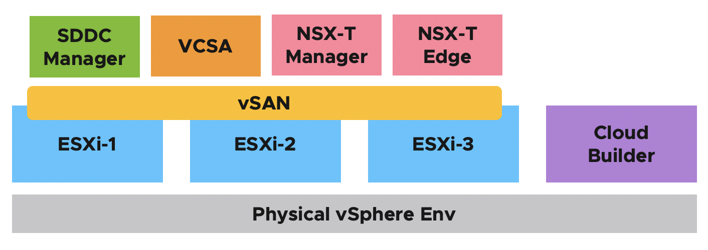

## Changelog
* **04/05/2024**
  * Split of the section "describes the location" to improve understanding
  * Replace " by ' for $VIPassword variable. A string enclosed in single quotation marks is a verbatim string. The string is passed to the command exactly as you type it. No substitution is performed.
  * When you deploy using JSON deployment method, you need to explicitly define the property clusterImageEnabled. This values was added and define to true.
* **03/27/2024**
  * Added support for license later (aka 60 day evaluation mode)
* **02/08/2024**
  * Added supplemental script `vcf-automated-workload-domain-deployment.ps1` to automate the deployment of Workload Domain
* **02/05/2024**
  * Improve substitution code for ESXi vMotion, vSAN & NSX CIDR network
  * Renamed variables (`$CloudbuilderVMName`,`$CloudbuilderHostname`,`$SddcManagerName`,`$NSXManagerVIPName`,`$NSXManagerNode1Name`) to (`$CloudbuilderVMHostname`,`$CloudbuilderFQDN`,`$SddcManagerHostname`,`$NSXManagerVIPHostname`,`$NSXManagerNode1Hostname`) to better represent the expected value (Hostname and FQDN)
* **02/03/2024**
  * Added support to independently define resources (cpu, memory and storage) for Nested ESXi VMs for use with Management and/or Workload Domains
  * Automatically generate VCF Workload Domain host commission JSON file (vcf-commission-host-api.json) for use with SDDC Manager API (UI will now include `-ui` in the filename)
* **01/29/2024**
  * Added support for [VCF 5.1]([text](https://blogs.vmware.com/cloud-foundation/2023/11/07/announcing-availability-of-vmware-cloud-foundation-5-1/))
  * Automatically start VCF Management Domain bringup in SDDC Manager using generated JSON deployment file (vcf-mgmt.json)
  * Added support for deploying Nested ESXi hosts for Workload Domain
  * Automatically generate VCF Workload Domain host commission JSON file (vcf-commission-host.json) for SDDC Manager
  * Added `-CoresPerSocket` argument to optimize for Nested ESXi deployment for licensing
  * Added variables (`$NestedESXivMotionNetworkCidr`, `$NestedESXivSANNetworkCidr` and `$NestedESXiNSXTepNetworkCidr`) for customizing ESXi vMotion, vSAN and NSX TEP network CIDRs

* **03/27/2023**
  * Enable Multiple deployment on the same Cluster

* **02/28/2023**
  * Added note on DRS-enabled Cluster for vApp creation and pre-check in code

* **02/21/2023**
  * Added note to Configuration for deploying VCF Management Domain using only a single ESXi host

* **02/09/2023**
  * Update ESXi Memory to fix "Configure NSX-T Data Center Transport Node" and "Reconfigure vSphere High Availability" failing tasks by increasing ESXi memory to 46GB [explained here](http://strivevirtually.net)

* **01/21/2023**
  * Added support for [VCF 4.5](https://imthiyaz.cloud/automated-vcf-deployment-script-with-nested-esxi)
  * Fixed vSAN bootdisk size
  * Follow [KB 89990](https://kb.vmware.com/s/article/89990) if you get "Gateway IP Address for Management is not contactable"
  * If Failed VSAN Diskgroup follow [FakeSCSIReservations](https://williamlam.com/2013/11/how-to-run-nested-esxi-on-top-of-vsan.html)

* **05/25/2021**
  * Initial Release

## Requirements
* vCenter Server running at least vSphere 7.0 or later
    * If your physical storage is vSAN, please ensure you've applied the following setting as mentioned [here](https://www.williamlam.com/2013/11/how-to-run-nested-esxi-on-top-of-vsan.html)
* ESXi Networking
  * Enable either [MAC Learning](https://williamlam.com/2018/04/native-mac-learning-in-vsphere-6-7-removes-the-need-for-promiscuous-mode-for-nested-esxi.html) or [Promiscuous Mode](https://kb.vmware.com/kb/1004099) on your physical ESXi host networking to ensure proper network connectivity for Nested ESXi workloads
* Resource Requirements
    * Compute
        * Ability to provision VMs with up to 8 vCPU (12 vCPU required for Workload Domain deployment)
        * Ability to provision up to 384 GB of memory
        * DRS-enabled Cluster (not required but vApp creation will not be possible)
    * Network
        * 1 x Standard or Distributed Portgroup (routable) to deploy all VMs (VCSA, NSX-T Manager & NSX-T Edge)
           * 13 x IP Addresses for Cloud Builder, SDDC Manager, VCSA, ESXi and NSX-T VMs
           * 9 x IP Addresses for Workload Domain Deployment (if applicable) for ESXi, NSX and VCSA
    * Storage
        * Ability to provision up to 1.25 TB of storage

        **Note:** For detailed requirements, plesae refer to the planning and preparation workbook [here](https://docs.vmware.com/en/VMware-Cloud-Foundation/5.1/vcf-planning-and-preparation-workbook.zip)

* VMware Cloud Foundation 4.x or 5.x Licenses for vCenter, ESXi, vSAN and NSX-T

* Desktop (Windows, Mac or Linux) with latest PowerShell Core and PowerCLI 12.1 Core installed. See [instructions here](https://blogs.vmware.com/PowerCLI/2018/03/installing-powercli-10-0-0-macos.html) for more details
* vSphere 8.0 Update 2 & Cloud Builder 5.1 or vSphere 7 Update 3h with Cloud Builder 4.5 or vSphere 7 Update 1d & Cloud Builder 4.2:
    * [VMware Cloud Builder (22688368) OVA]([https://my.vmware.com/web/vmware/downloads/details?downloadGroup=VCF420&productId=1121&rPId=60057](https://customerconnect.vmware.com/downloads/details?downloadGroup=VCF510&productId=1484&rPId=112797))
    * [Nested ESXi 8.0 Update 2 OVA](https://download3.vmware.com/software/vmw-tools/nested-esxi/Nested_ESXi8.0u2_Appliance_Template_v2.ova)

## Configuration

Before you can run the script, you will need to edit the script and update a number of variables to match your deployment environment. Details on each section is described below including actual values used in my home lab environment.

This section describes the credentials to your physical vCenter Server in which the VCF lab environment will be deployed to:
```console
$VIServer = "FILL-ME-IN"
$VIUsername = "FILL-ME-IN"
$VIPassword = 'FILL-ME-IN'
```

This section describes the environment to your physical vCenter Server in which the VCF lab environment will be deployed to:
```console
$VMDatacenter = "San Jose"
$VMCluster = "Compute Cluster"
$VMNetwork = "sjc-comp-mgmt (1731)"
$VMDatastore = "comp-vsanDatastore"
$VMFolder = "VCF"
```

This section describes the location of the files required for deployment.
```console
$NestedESXiApplianceOVA = "C:\Users\william\Desktop\VCF\Nested_ESXi8.0u2b_Appliance_Template_v1.ova"
$CloudBuilderOVA = "C:\Users\william\Desktop\VCF\VMware-Cloud-Builder-5.1.1.0-23480823_OVF10.ova"
```

This section defines the licenses for each component within VCF. If you wish to use 60 day evaluational mode, you can leave these fields blank but you need to use VCF 5.1.1 or later
```console
$VCSALicense = ""
$ESXILicense = ""
$VSANLicense = ""
$NSXLicense = ""
```

This section defines the VCF configurations including the name of the output files for deploying the VCF Management Domain along with additional ESXi hosts to commission for use with either SDDC Manager UI or API for VCF Workload Domain deployment. The default values are sufficient.
```console
$VCFManagementDomainPoolName = "vcf-m01-rp01"
$VCFManagementDomainJSONFile = "vcf-mgmt.json"
$VCFWorkloadDomainUIJSONFile = "vcf-commission-host-ui.json"
$VCFWorkloadDomainAPIJSONFile = "vcf-commission-host-api.json"
```

This section describes the configuration for the VMware Cloud Builder virtual appliance:
```console
$CloudbuilderVMHostname = "vcf-m01-cb01"
$CloudbuilderFQDN = "vcf-m01-cb01.tshirts.inc"
$CloudbuilderIP = "172.17.31.180"
$CloudbuilderAdminUsername = "admin"
$CloudbuilderAdminPassword = "VMw@re123!"
$CloudbuilderRootPassword = "VMw@re123!"
```

This section describes the configuration that will be used to deploy SDDC Manager within the Nested ESXi environment:
```console
$SddcManagerHostname = "vcf-m01-sddcm01"
$SddcManagerIP = "172.17.31.181"
$SddcManagerVcfPassword = "VMware1!VMware1!"
$SddcManagerRootPassword = "VMware1!VMware1!"
$SddcManagerRestPassword = "VMware1!VMware1!"
$SddcManagerLocalPassword = "VMware1!VMware1!"
```

This section defines the number of Nested ESXi VMs to deploy along with their associated IP Address(s). The names are the display name of the VMs when deployed and you should ensure these are added to your DNS infrastructure. A minimum of four hosts is required for proper VCF deployment.
```console
$NestedESXiHostnameToIPsForManagementDomain = @{
    "vcf-m01-esx01"   = "172.17.31.185"
    "vcf-m01-esx02"   = "172.17.31.186"
    "vcf-m01-esx03"   = "172.17.31.187"
    "vcf-m01-esx04"   = "172.17.31.188"
}
```

This section defines the number of Nested ESXi VMs to deploy along with their associated IP Address(s) for use in a Workload Domain deployment. The names are the display name of the VMs when deployed and you should ensure these are added to your DNS infrastructure. A minimum of four hosts should be used for Workload Domain deployment
```console
$NestedESXiHostnameToIPsForWorkloadDomain = @{
    "vcf-m01-esx05"   = "172.17.31.189"
    "vcf-m01-esx06"   = "172.17.31.190"
    "vcf-m01-esx07"   = "172.17.31.191"
    "vcf-m01-esx08"   = "172.17.31.192"
}
```

**Note:** A VCF Management Domain can be deployed with just a single Nested ESXi VM. For more details, please see this [blog post](https://williamlam.com/2023/02/vmware-cloud-foundation-with-a-single-esxi-host-for-management-domain.html) for the required tweaks.

This section describes the amount resources to allocate to either the Nested ESXi VM(s) for use with Managemen Domain as well as Workload Domain (if you choose to deploy.) Depending on your usage, you may want to increase the resources but for proper functionality, this is the minimum to start with. For Memory and Disk configuration, the unit is in GB.
```console
# Nested ESXi VM Resources for Management Domain
$NestedESXiMGMTvCPU = "12"
$NestedESXiMGMTvMEM = "78" #GB
$NestedESXiMGMTCachingvDisk = "4" #GB
$NestedESXiMGMTCapacityvDisk = "200" #GB
$NestedESXiMGMTBootDisk = "32" #GB

# Nested ESXi VM Resources for Workload Domain
$NestedESXiWLDvCPU = "8"
$NestedESXiWLDvMEM = "24" #GB
$NestedESXiWLDCachingvDisk = "4" #GB
$NestedESXiWLDCapacityvDisk = "75" #GB
$NestedESXiWLDBootDisk = "32" #GB
```

This section describes the Nested ESXi Networks that will be used for VCF configuration. For the ESXI management network, the CIDR definition should match the network specified in `$VMNetwork` variable.
```console
$NestedESXiManagementNetworkCidr = "172.17.31.0/24"
$NestedESXivMotionNetworkCidr = "172.17.32.0/24"
$NestedESXivSANNetworkCidr = "172.17.33.0/24"
$NestedESXiNSXTepNetworkCidr = "172.17.34.0/24"
```

This section describes the configurations that will be used to deploy the VCSA within the Nested ESXi environment:
```console
$VCSAName = "vcf-m01-vc01"
$VCSAIP = "172.17.31.182"
$VCSARootPassword = "VMware1!"
$VCSASSOPassword = "VMware1!"
```

This section describes the configurations that will be used to deploy the NSX-T infrastructure within the Nested ESXi environment:
```console
$NSXManagerVIPHostname = "vcf-m01-nsx01"
$NSXManagerVIPIP = "172.17.31.183"
$NSXManagerNode1Hostname = "vcf-m01-nsx01a"
$NSXManagerNode1IP = "172.17.31.184"
$NSXRootPassword = "VMware1!VMware1!"
$NSXAdminPassword = "VMware1!VMware1!"
$NSXAuditPassword = "VMware1!VMware1!"
```

This section describes the generic networking settings applied to Nested ESXi & Cloud Builder VMs:

```console
$VMNetmask = "255.255.255.0"
$VMGateway = "172.17.31.1"
$VMDNS = "172.17.31.2"
$VMNTP = "172.17.31.2"
$VMPassword = "VMware1!"
$VMDomain = "tshirts.inc"
$VMSyslog = "172.17.31.182"
```

> **Note:** It is recommended that you use an NTP server that has both forward and DNS resolution configured. If this is not done, during the VCF JSON pre-req validation phase, it can take longer than expected for the DNS timeout to complete prior to allowing user to continue to VCF deployment.

Once you have saved your changes, you can now run the PowerCLI script as you normally would.

## Logging

There is additional verbose logging that outputs as a log file in your current working directory **vcf-lab-deployment.log**

## Sample Execution

In the example below, I will be using a one /24 VLANs (172.17.31/0/24). The first network will be used to provision all VMs and place them under typical vSphere Management network configuration and 5 IPs will be allocated from this range for the Supervisor Control Plane and 8 IPs for the NSX ALB Service Engine. The second network will combine both IP ranges for the NSX ALB VIP/Frontend function as well as the IP ranges for Workloads. See the table below for the explicit network mappings and it is expected that you have a setup similar to what has been outlined.

|           Hostname          | IP Address    | Function       |
|:---------------------------:|---------------|----------------|
| vcf-m01-cb01.tshirts.inc    | 172.17.31.180 | Cloud Builder  |
| vcf-m01-sddcm01.tshirts.inc | 172.17.31.181 | SDDC Manager   |
| vcf-m01-vc01.tshirts.inc    | 172.17.31.182 | vCenter Server |
| vcf-m01-nsx01.tshirts.inc   | 172.17.31.183 | NSX-T VIP      |
| vcf-m01-nsx01a.tshirts.inc  | 172.17.31.184 | NSX-T Node 1   |
| vcf-m01-esx01.tshirts.inc   | 172.17.31.185 | ESXi Host 1    |
| vcf-m01-esx02.tshirts.inc   | 172.17.31.186 | ESXi Host 2    |
| vcf-m01-esx03.tshirts.inc   | 172.17.31.187 | ESXi Host 3    |
| vcf-m01-esx04.tshirts.inc   | 172.17.31.188 | ESXi Host 4    |
| vcf-m01-esx05.tshirts.inc   | 172.17.31.189 | ESXi Host 5    |
| vcf-m01-esx06.tshirts.inc   | 172.17.31.190 | ESXi Host 6    |
| vcf-m01-esx07.tshirts.inc   | 172.17.31.191 | ESXi Host 7    |
| vcf-m01-esx08.tshirts.inc   | 172.17.31.192 | ESXi Host 8    |

### Lab Deployment Script

Here is a screenshot of running the script if all basic pre-reqs have been met and the confirmation message before starting the deployment:

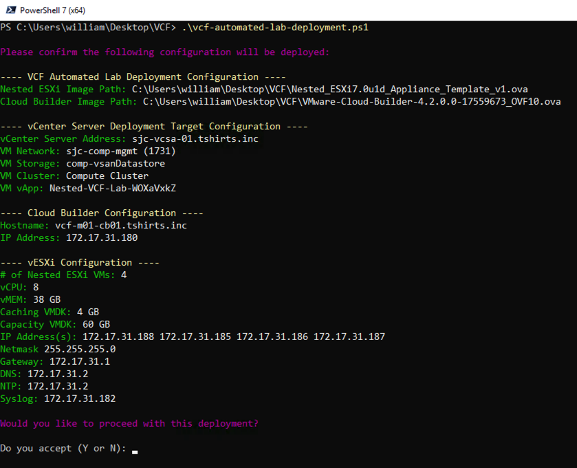

Here is an example output of a complete deployment:

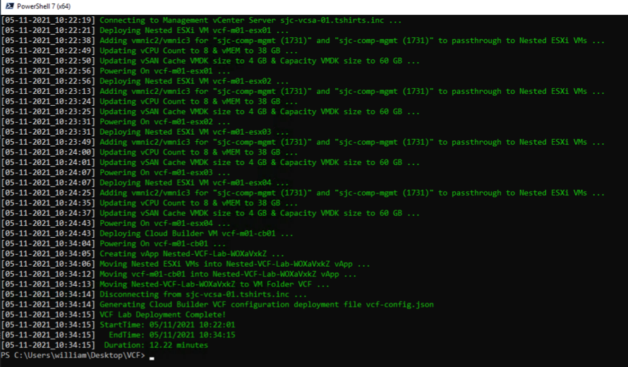

**Note:** Deployment time will vary based on underlying physical infrastructure resources. In my lab, this took ~19min to complete.

Once completed, you will end up with eight Nested ESXi VM and VMware Cloud Builder VMs which is placed into a vApp.

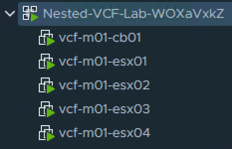

### Deploy VCF Management Domain

By default, the script will auto generate the required VCF Management Domain deployment file `vcf-mgmt.json` based off of your specific deployment and save that into the current working directory. Additionally, the VCF deployment file will automatically be submitted to SDDC Manager and begin the VCF Bringup process, which in previous versions of this script was performed manually by the end user.

Now you can just open a web browser to your SDDC Manager deployment and monitor the VCF Bringup progress.

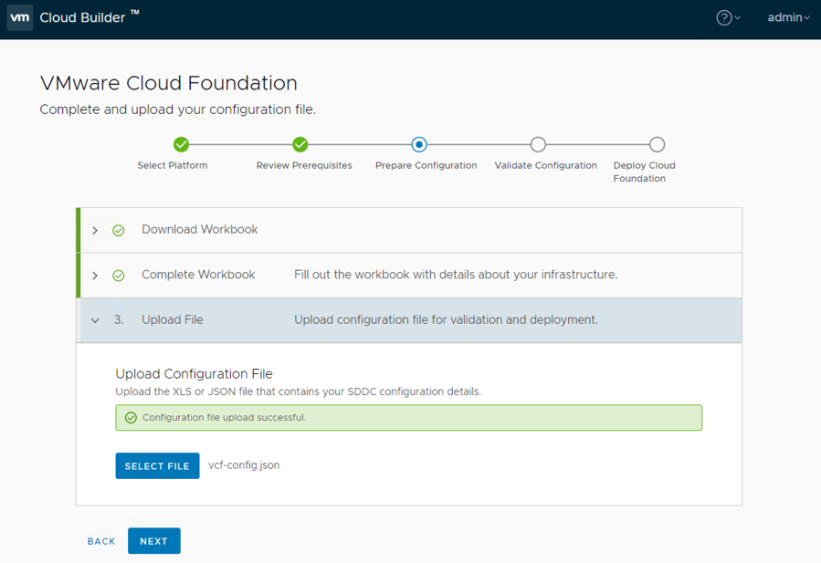

**Note:** If you wish to disable the VCF Bringup process, simply search for the variable named `$startVCFBringup` in the script and change the value to 0.

The deployment and configuration can take up to several hours to complete depending on the resources of your underlying hardware. In this example, the deployment took about ~1.5 to complete and you should see a success message as shown below.

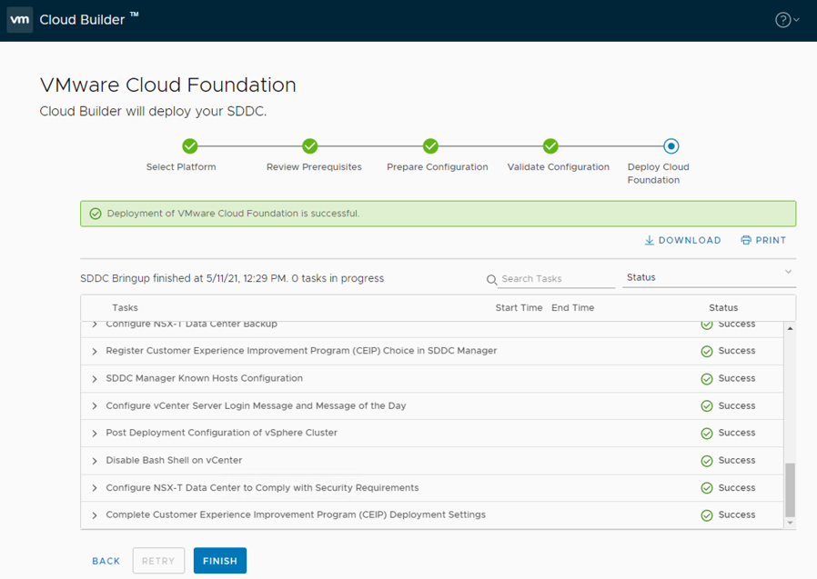

Click on the Finish button which should prompt you to login to SDDC Manager. You will need to use `administrator@vsphere.local` credentials that you had configured within the deployment script for the deployed vCenter Server.

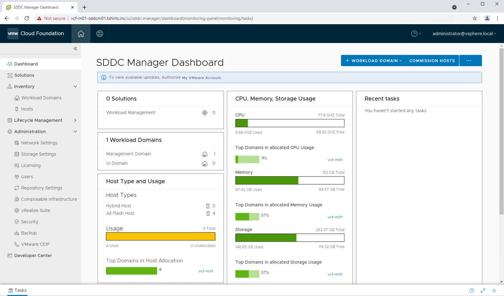

### Deploy VCF Workload Domain

## Manual Method

By default, the script will auto generate the VCF Workload Domain host commission file `vcf-commission-host-ui.json` based off of your specific deployment and save that into the current working directory.

Once the VCF Management Domain has been deployed, you can login to SDDC Manager UI and under `Inventory->Hosts`, click on the `COMMISSION HOSTS` button and upload the generated JSON configuration file.

**Note:** There is currently a different JSON schema between the SDDC Manager UI and API for host commission and the generated JSON file can only be used by SDDC Manager UI. For the API, you need to make some changes to the file including replacing the networkPoolName with the correct networkPoolId. For more details, please refer to the JSON format in the [VCF Host Commission API]([text](https://developer.vmware.com/apis/vcf/latest/v1/hosts/post/))

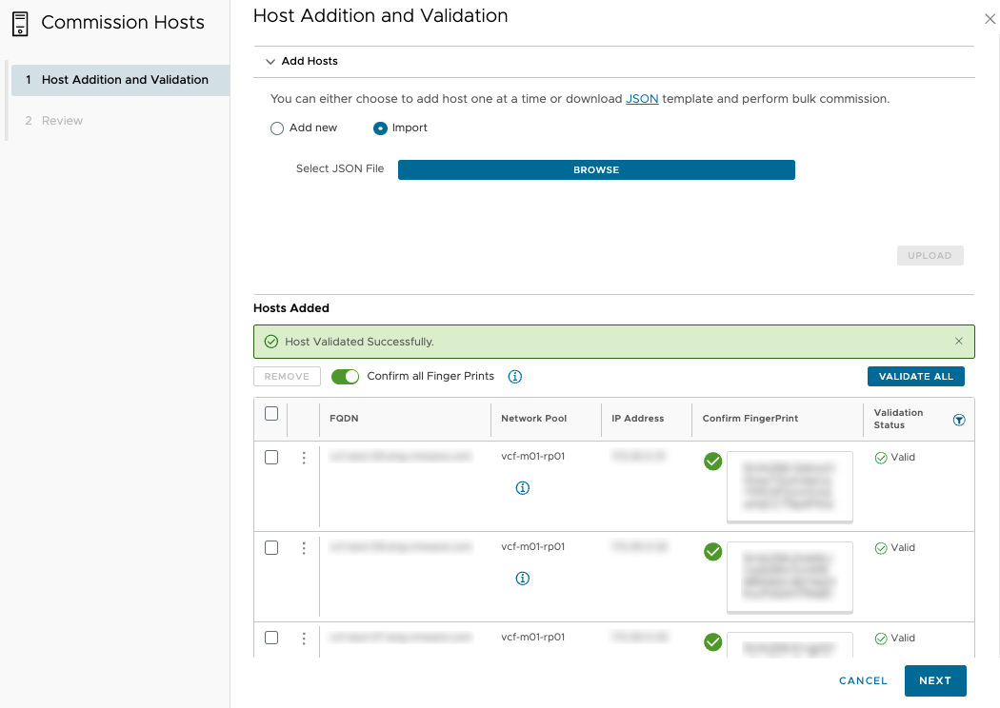

Once the ESXi hosts have been added to SDDC Manager, then you can perform a manual VCF Workload Domain deployment using either the SDDC Manager UI or API.

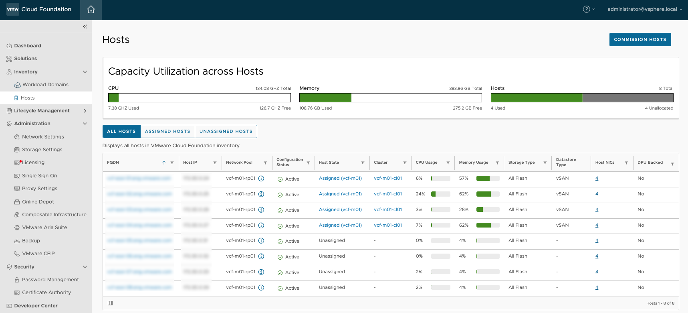

## Automated Method

A supplemental auotomation script `vcf-automated-workload-domain-deployment.ps1` will be used to automatically standup the workfload domain. It will assume that the VCF Workload Domain host commission file `vcf-commission-host-api.json` was generated from running the initial deployent script and this file will contain a "TBD" field because the SDDC Manager API expects the Management Domain Network Pool ID, which will be retrieved automatically as part of using the additional automation.

Here is an example of what will be deployed as part of Workload Domain creation:

|           Hostname          | IP Address    | Function       |
|:---------------------------:|---------------|----------------|
| vcf-w01-vc01.tshirts.inc    | 172.17.31.120 | vCenter Server |
| vcf-w01-nsx01.tshirts.inc   | 172.17.31.121 | NSX-T VIP      |
| vcf-w01-nsx01a.tshirts.inc  | 172.17.31.122 | NSX-T Node 1   |
| vcf-w01-nsx01b.tshirts.inc  | 172.17.31.122 | NSX-T Node 2   |
| vcf-w01-nsx01c.tshirts.inc  | 172.17.31.122 | NSX-T Node 3   |


### Configuration

This section describes the credentials to your deployed SDDC Manager from setting up the Management Domain:
```console
$sddcManagerFQDN = "FILL_ME_IN"
$sddcManagerUsername = "FILL_ME_IN"
$sddcManagerPassword = "FILL_ME_IN"
```

This section defines the licenses for each component within VCF
```console
$ESXILicense = "FILL_ME_IN"
$VSANLicense = "FILL_ME_IN"
$NSXLicense = "FILL_ME_IN"
```

This section defines the Management and Workload Domain configurations, which the default values should be sufficient unless you have modified anything from the original deployment script
```console
$VCFManagementDomainPoolName = "vcf-m01-rp01"
$VCFWorkloadDomainAPIJSONFile = "vcf-commission-host-api.json"
$VCFWorkloadDomainName = "wld-w01"
$VCFWorkloadDomainOrgName = "vcf-w01"
```

This section defines the vCenter Server configuration that will be used in the Workload Domain
```console
$VCSAHostname = "vcf-w01-vc01"
$VCSAIP = "172.17.31.120"
$VCSARootPassword = "VMware1!"
```

This section defines the NSX Manager configurations that will be used in the Workload Domain
```console
$NSXManagerVIPHostname = "vcf-w01-nsx01"
$NSXManagerVIPIP = "172.17.31.121"
$NSXManagerNode1Hostname = "vcf-m01-nsx01a"
$NSXManagerNode1IP = "172.17.31.122"
$NSXManagerNode2Hostname = "vcf-m01-nsx01b"
$NSXManagerNode2IP = "172.17.31.123"
$NSXManagerNode3Hostname = "vcf-m01-nsx01c"
$NSXManagerNode3IP = "172.17.31.124"
$NSXAdminPassword = "VMware1!VMware1!"
```

This section defines basic networking information that will be needed to deploy vCenter and NSX components
```console
$VMNetmask = "255.255.255.0"
$VMGateway = "172.17.31.1"
$VMDomain = "tshirts.inc"
```

### Example Deployment

Here is a screenshot of running the script if all basic pre-reqs have been met and the confirmation message before starting the deployment:

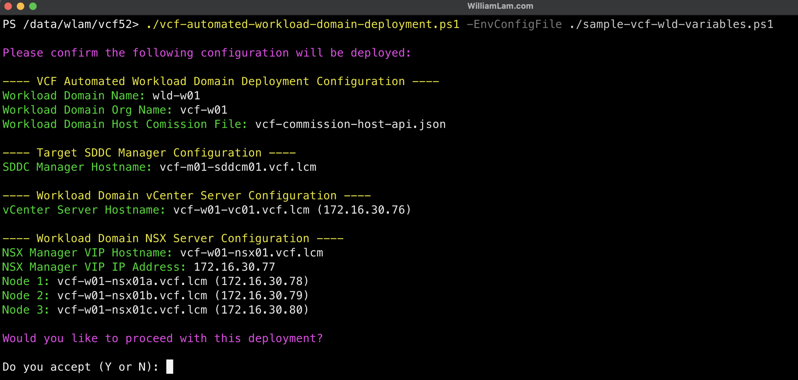

Here is an example output of a completed deployment:

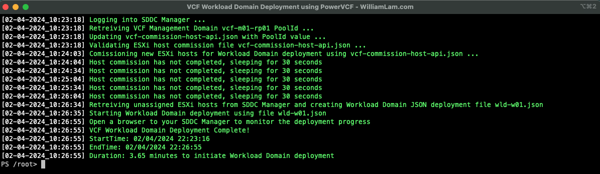

**Note:** While the script should finish ~3-4 minutes, the actual creation of the Workload Domain will take a bit longer and will depend on your resources.

To monitor the progress of your Workload Domain deployment, login to the SDDC Manager UI


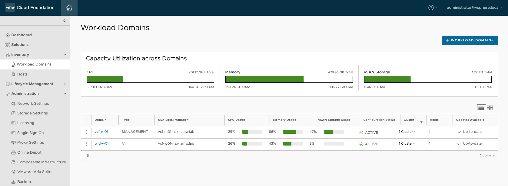

If you now login to your vSphere UI for your Management Domain, you should see the following inventory 

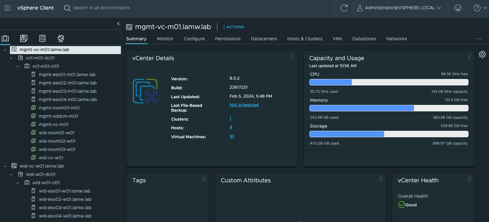